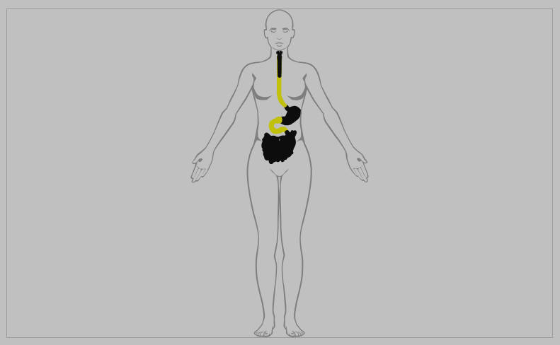
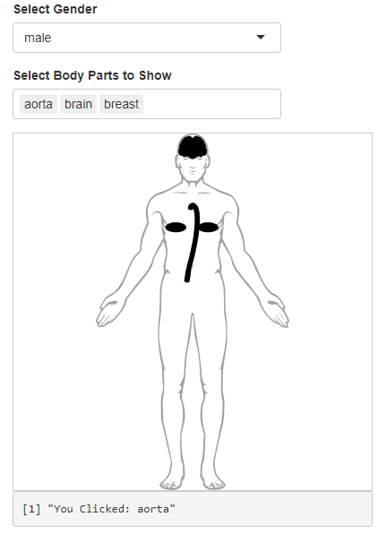
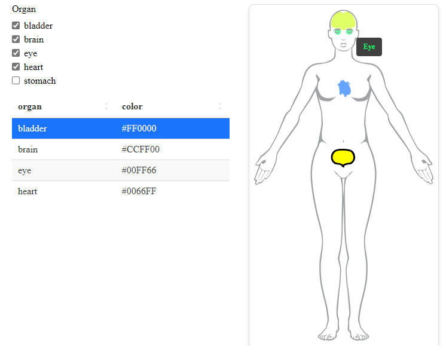

<!-- README.md is generated from README.Rmd. Please edit that file -->

```{r, include = FALSE}
knitr::opts_chunk$set(
  collapse = TRUE,
  comment = "#>",
  fig.path = "man/figures/README-",
  out.width = "100%"
)
```

# shinybody

<!-- badges: start -->
<!-- badges: end -->

`shinybody` is an `htmlwidget` of the human body that allows you to hide/show and assign colors to 79 different body parts.
The `human` widget is an `htmlwidget`, so it works in Quarto documents, R Markdown documents, or anything other HTML medium.
It also functions as an input/output widget in a `shiny` app. 

## Installation

You can install the development version of `shinybody` from [GitHub](https://github.com/) with:

``` r
# install.packages("devtools")
devtools::install_github("robert-norberg/shinybody")
```

You can install from CRAN with:

```r
install.packages("shinybody")
```

## Example

Here is a simple example of using the `human` widget in an R Markdown document:

```{r example, eval = FALSE}
library(shinybody)

example_organs <- c("brain", "eye", "heart", "stomach", "bladder")
my_organ_df <- subset(shinybody::shinybody_organs, organ %in% example_organs)
my_organ_df$show <- TRUE
my_organ_df$color <- grDevices::rainbow(nrow(my_organ_df))
my_organ_df$selected[1] <- TRUE
my_organ_df$hovertext <- mapply(
  function(o, clr) htmltools::strong(tools::toTitleCase(o), style = paste("color:", clr)),
  my_organ_df$organ,
  my_organ_df$color,
  SIMPLIFY = FALSE
)
human(gender = "female", organ_df = my_organ_df)
```



Here is a complete list of the organs that are available:

```{r, echo = FALSE}
data.frame(
  row.names = shinybody::shinybody_organs$organ,
  Male = ifelse(shinybody::shinybody_organs$male, "✅", "❌"),
  Female = ifelse(shinybody::shinybody_organs$female, "✅", "❌")
)
```

Here is a very simple shiny app using the `human` widget:

```{r, eval = FALSE}
library(shiny)
library(shinybody)

ui <- function() {
  fluidPage(
    selectInput(
      inputId = "gender",
      label = "Select Gender",
      choices = c("male", "female"),
      multiple = FALSE,
      selected = "male"
    ),
    selectInput(
      inputId = "body_parts",
      label = "Select Body Parts to Show",
      choices = names(shinybody:::organ_to_id[["male"]]),
      multiple = TRUE,
      selected = names(shinybody:::organ_to_id[["male"]])[1:5]
    ),
    humanOutput(outputId = "human_widget"),
    verbatimTextOutput(outputId = "clicked_body_part_msg"),
    verbatimTextOutput(outputId = "selected_body_parts_msg")
  )
}

server <- function(input, output, session) {
  observe({
    g <- input$gender
    
    updateSelectInput(
      session = session,
      inputId = "body_parts",
      choices = names(shinybody:::organ_to_id[[g]]),
      selected = names(shinybody:::organ_to_id[[g]])[1:5]
    )
  })
  
  output$human_widget <- renderHuman({
    selected_organ_df <- subset(shinybody::shinybody_organs, organ %in% input$body_parts)
    selected_organ_df$show <- TRUE
    human(
      gender = input$gender,
      organ_df = selected_organ_df,
      select_color = "red"
    )
  })
  output$clicked_body_part_msg <- renderPrint({
    paste("You Clicked:", input$clicked_body_part)
  })
  output$selected_body_parts_msg <- renderPrint({
    paste("Selected:", paste(input$selected_body_parts, collapse = ", "))
  })
}

shinyApp(ui = ui, server = server)
```



`shinybody` is `crosstalk` compatible. Here is an example of a simple `crosstalk` widget using `shinybody` and `DT`.

```{r, eval = FALSE}
library(shinybody)
library(DT)

example_organs <- c("brain", "eye", "heart", "stomach", "bladder")
my_organ_df <- subset(shinybody::shinybody_organs, organ %in% example_organs)
my_organ_df$show <- TRUE
my_organ_df$color <- grDevices::rainbow(nrow(my_organ_df))
my_organ_df$selected[1] <- TRUE
my_organ_df$hovertext <- mapply(
  function(o, clr) htmltools::strong(tools::toTitleCase(o), style = paste("color:", clr)),
  my_organ_df$organ,
  my_organ_df$color,
  SIMPLIFY = FALSE
)

my_organ_df_shared_data <- crosstalk::SharedData$new(my_organ_df)

checkboxes <- crosstalk::filter_checkbox(
  id = "filter",
  label = "Organ",
  sharedData = my_organ_df_shared_data,
  group = ~organ
)

tbl <- DT::datatable(
  data = my_organ_df_shared_data,
  options = list(
    pageLength = 10,
    columnDefs = list(
      list(visible = FALSE, targets = c("male", "female", "show", "selected", "hovertext"))
    )
  ),
  rownames = FALSE,
  height = "500px",
  autoHideNavigation = TRUE
)

crosstalk::bscols(
  htmltools::tagList(checkboxes, tbl),
  human(gender = "female", organ_df = my_organ_df_shared_data),
  device = "sm"
)
```


